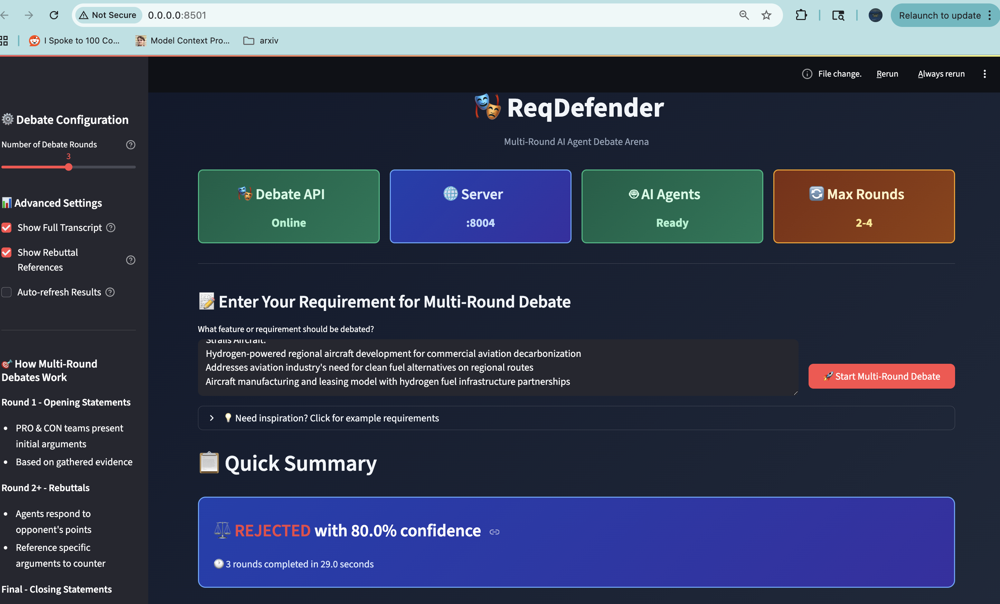

# 🛡️ ReqDefender: Multi-Round AI Debate Arena

<div align="center">
  
  
  
  
  
  **Watch AI agents battle through multiple rounds with real rebuttals and interactive evidence**
  
</div>

## 🚀 Quick Start - Multi-Round Debates

### 📸 Demo Screenshot

<div align="center">



**Live Demo:** *Hydrogen-powered aircraft requirement analysis - REJECTED with 80% confidence in 29 seconds*

</div>

### 30-Second Demo

```bash
# 1. Clone and install
git clone <repo> && cd req-defender
python3 -m pip install streamlit anthropic openai python-dotenv duckduckgo-search langchain-community fastapi uvicorn aiohttp

# 2. Set API key (choose one)
export ANTHROPIC_API_KEY="sk-ant-api03-your_key_here"
# OR
export OPENAI_API_KEY="sk-proj-your_key_here"

# 3. Start multi-round debate system
./start_debate.sh

# 4. Open browser to http://localhost:8501
```

### System Components

**🎭 Multi-Round Debate API** (`api_debate.py`)
- True multi-round debates (2-4 rounds)
- Agents respond to each other's arguments
- Real evidence gathering and rebuttals

**📱 Interactive Web Interface** (`streamlit_debate.py`)  
- Progressive loading system
- Collapsible rounds and timeline navigation
- Rich debate visualization

**🧪 Comprehensive Testing** (`test_api_debate.py`)
- Multi-round debate validation
- Performance benchmarking
- Integration testing

## 🎯 Multi-Round Debate Features

### True Agent Interactions
- **Round 1**: Opening statements with evidence
- **Round 2+**: Agents respond to specific opponent arguments  
- **Final**: Closing summaries before judge verdict
- **Real Rebuttals**: Agents reference and counter opponent points

### Progressive Web Interface
- **Quick Summary**: Immediate verdict and key metrics
- **Tabbed Navigation**: Statistics, Rounds, Statements, Decision
- **Collapsible Content**: Control information density
- **Interactive Timeline**: Jump to specific rounds

### Enhanced Judge Analysis
- **Complete Debate Review**: Analyzes entire progression
- **Winning Arguments**: Identifies strongest points
- **Decisive Factors**: Explains what influenced the decision
- **Detailed Reasoning**: Full verdict breakdown

## 🏃‍♂️ Usage Options

### Option 1: Complete System (Recommended)
```bash
./start_debate.sh
# Starts: API (port 8004) + Web UI (port 8501) + All services
```

### Option 2: Individual Components
```bash
# Start debate API only
python3 api_debate.py                    # Port 8004

# Start web interface (requires API)
python3 -m streamlit run streamlit_debate.py --server.address 0.0.0.0

# Test the system
python3 test_api_debate.py
```

### Option 3: API Integration
```bash
# Quick 2-round debate
curl -X POST "http://localhost:8004/quick-debate?requirement=Add%20dark%20mode"

# Full 3-round debate
curl -X POST "http://localhost:8004/debate" \
  -H "Content-Type: application/json" \
  -d '{"requirement": "Implement AI chatbot", "num_rounds": 3}'
```

## 🎮 Multi-Round Debate Flow

### 1. Evidence Gathering (Real Web Search)
- DuckDuckGo + Brave API integration
- Separate PRO/CON evidence collection
- Quality scoring and source validation

### 2. Opening Statements (Round 1)
- Both teams present initial arguments
- Evidence-based reasoning
- Set the debate foundation

### 3. Rebuttal Rounds (Rounds 2-4)
- Agents directly respond to opponent arguments
- Reference specific points being countered
- Build cumulative case through interaction

### 4. Closing Statements
- Teams synthesize their strongest arguments
- Address opponent's key weaknesses
- Final appeals to the judge

### 5. Judge Analysis
- Reviews complete debate progression
- Identifies winning arguments and decisive factors
- Renders verdict with detailed reasoning

## 🏗️ System Architecture

```
reqdefender/
├── 🎭 Multi-Round Debate System (Latest & Best)
│   ├── api_debate.py              # Multi-round debate API
│   ├── streamlit_debate.py        # Advanced web interface
│   ├── test_api_debate.py         # Comprehensive test suite
│   ├── start_debate.sh            # Quick start script
│   └── README_DEBATE.md           # Detailed documentation
│
├── 📊 Stable AI Implementation
│   ├── streamlit_simple.py        # Simple web interface
│   ├── api_ai_simple.py           # Basic AI API
│   └── test_simple_api.py         # Basic testing
│
├── 🔧 Configuration & Utils
│   ├── config.py                  # Centralized configuration
│   ├── app.py                     # Enhanced launcher
│   └── CLAUDE.md                  # Project documentation
│
├── 🔍 Research Pipeline
│   └── research/
│       └── searcher_working.py    # Web search integration
│
└── 📚 Documentation
    ├── docs/
    │   └── debate_improvements_brainstorm.md
    └── .env.example               # Environment template
```

## 🎨 Interface Highlights

### Clean, Professional Design
- **Color-coded timeline**: Blue (Opening), Red (Rebuttal), Green (Closing)
- **High-contrast UI**: No white button pollution
- **Progressive disclosure**: Information revealed as needed
- **Mobile responsive**: Works on all devices

### Interactive Features
- **Timeline navigation**: Jump to any round instantly
- **Expandable arguments**: Control content visibility
- **Show/hide controls**: Customize your view
- **Real-time progress**: Watch debates unfold

### Rich Visualizations
- **Debate statistics**: Performance metrics and timing
- **Argument tracking**: See which points agents address
- **Evidence display**: Supporting research and sources
- **Judge breakdown**: Detailed verdict analysis

## 🧪 Testing & Validation

### Automated Test Suite
```bash
python3 test_api_debate.py
```

**Tests Include:**
- Multi-round debate functionality (2-4 rounds)
- Agent interaction and rebuttal generation
- Judge analysis and verdict rendering
- Performance benchmarking (timing, confidence)
- API endpoint validation

### Performance Metrics
- **2 rounds**: ~20 seconds
- **3 rounds**: ~25 seconds  
- **4 rounds**: ~35 seconds
- **Confidence variance**: More rounds = more nuanced analysis

## 🔧 Configuration

### Environment Variables
```bash
# API Keys (choose one or both)
ANTHROPIC_API_KEY="sk-ant-api03-your_key_here"
OPENAI_API_KEY="sk-proj-your_key_here"

# Server Configuration
DEBATE_API_PORT=8004              # Multi-round debate API
STREAMLIT_PORT=8501               # Web interface  
AI_API_PORT=8003                  # Simple API (legacy)

# Debug & Performance
DEBUG=true                        # Enable detailed logging
MAX_EVIDENCE_SOURCES=10           # Evidence gathering limit
```

### Judge Personalities
- **Pragmatist**: Favors proven solutions with clear ROI
- **Innovator**: Embraces calculated risks for breakthroughs  
- **User Advocate**: Prioritizes user experience above all

### Debate Intensity
- **2 Rounds**: Quick validation (~20 seconds)
- **3 Rounds**: Standard analysis (~25 seconds)
- **4 Rounds**: Deep investigation (~35 seconds)

## 🚀 Recent Major Improvements

### ✅ Multi-Round Debate System
- **True agent interactions** - agents respond to each other
- **Progressive web interface** - non-overwhelming content display
- **Enhanced judge analysis** - complete debate evaluation
- **Professional UI design** - clean, color-coded interface

### ✅ Critical Bug Fixes
- **Fixed raw HTML display** - eliminated broken interface elements
- **Improved button styling** - consistent, professional appearance  
- **Enhanced visibility** - high-contrast, accessible design
- **Streamlined examples** - clean, simple user experience

### ✅ System Reliability
- **Native component usage** - reliable Streamlit integration
- **Comprehensive testing** - automated validation suite
- **Error handling** - graceful failure recovery
- **Production ready** - stable, performant architecture

## 📊 API Documentation

### Multi-Round Debate Endpoints

**Health Check**
```bash
GET /health
# Returns: {"status": "healthy", "ai_available": true}
```

**Quick Debate (2 rounds)**
```bash
POST /quick-debate?requirement=<requirement>
# Returns: Quick verdict with summary
```

**Full Debate (2-4 rounds)**
```bash
POST /debate
Content-Type: application/json

{
  "requirement": "Your requirement here",
  "num_rounds": 3
}

# Returns: Complete debate transcript with verdicts
```

### Response Format
```json
{
  "success": true,
  "requirement": "Add AI chatbot",
  "verdict": "APPROVED",
  "confidence": 85.5,
  "total_rounds": 3,
  "duration_seconds": 24.7,
  "transcript": {
    "rounds": [...],
    "final_summaries": {...},
    "judge_verdict": {...}
  }
}
```

## 🔍 Troubleshooting

### Common Issues

**Issue: API not starting**
```bash
# Check port conflicts
lsof -i :8004

# Kill existing processes
pkill -f "api_debate.py"

# Restart
./start_debate.sh api
```

**Issue: Web interface showing HTML code**
```bash
# This issue has been fixed - use native Streamlit components
# If you see raw HTML, you're using an outdated version
git pull origin main
python3 -m streamlit run streamlit_debate.py
```

**Issue: No AI responses**
```bash
# Verify API keys
python3 -c "import os; from dotenv import load_dotenv; load_dotenv(); print('Anthropic:', bool(os.getenv('ANTHROPIC_API_KEY'))); print('OpenAI:', bool(os.getenv('OPENAI_API_KEY')))"

# Check API health
curl http://localhost:8004/health
```

## 🤝 Contributing

1. Fork the repository
2. Create feature branch (`git checkout -b feature/amazing-feature`)
3. Make your changes
4. Test thoroughly (`python3 test_api_debate.py`)
5. Commit with clear messages
6. Push and create Pull Request

## 📝 License

MIT License - see [LICENSE](LICENSE) file for details.

## 🙏 Acknowledgments

- **Anthropic Claude & OpenAI GPT** for AI capabilities
- **Streamlit** for rapid web interface development
- **DuckDuckGo & Brave** for real-time search integration
- **FastAPI** for robust API framework

---

<div align="center">
  
**Stop Building Features Nobody Wants. Start Building Value.**

🎭 **Multi-Round AI Debates** • 📊 **Evidence-Based Decisions** • ⚖️ **Intelligent Verdicts**

Made with ❤️ by developers who believe in data-driven product decisions

</div>
#built with love
